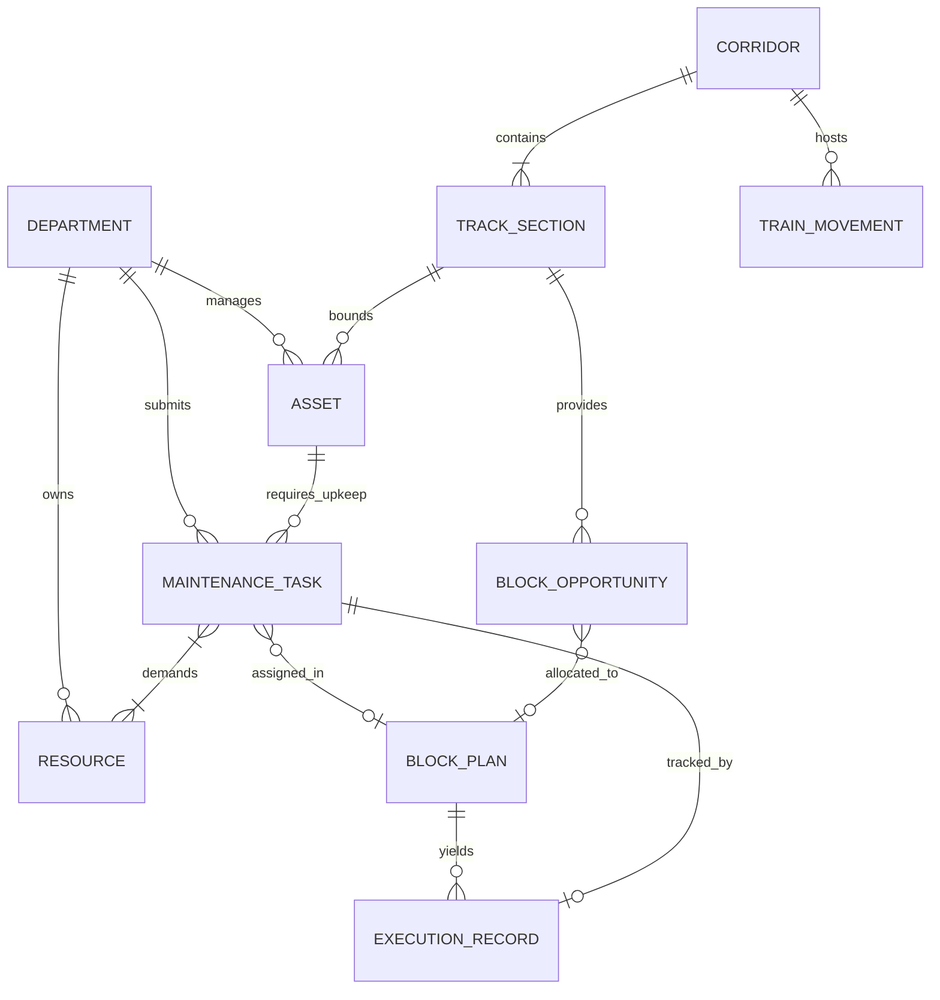

# Entity Relationship Diagram & Domain Interactions — SIH26027

This document illustrates how the core entities of the Intelligent Railway Maintenance Block Decision-Support System interact with one another.

---

## 1. Domain Relationship Explanations

1. **Asset → Maintenance Tasks (1-to-Many):**  
   An **Asset** (e.g., a 2 km track segment) can have multiple **Maintenance Tasks** requested over time (e.g., track tamping, rail inspection, sleeper replacement). Every task targets exactly one asset.

2. **Maintenance Task → Department (Many-to-1):**  
   Every **Maintenance Task** belongs to a specific **Department** (Engineering, Signal & Telecom, or Traction Distribution) that submitted the work request.

3. **Maintenance Task → Resources (Many-to-Many):**  
   A **Maintenance Task** may require one or more **Resources** (e.g., 1 Tamping Machine + 1 Maintenance Crew). A single resource can be assigned to different tasks over time, but cannot be double-booked simultaneously.

4. **Maintenance Task & Block Opportunity → Corridor / Track Section (Many-to-1):**  
   Both **Maintenance Tasks** and **Block Opportunities** are spatially tied to a specific **Corridor** and **Track Section**.

5. **Train Movement → Corridor (Many-to-1):**  
   **Train Movements** operate along a **Corridor**, occupying specific track sections during their scheduled run.

6. **Block Plan → Maintenance Tasks (1-to-Many):**  
   A **Block Plan** generated by the optimization engine selects and schedules multiple **Maintenance Tasks** into assigned block windows.

7. **Block Plan → Block Opportunities (1-to-Many):**  
   A **Block Plan** maps selected tasks onto one or more candidate **Block Opportunities** along the corridor.

8. **Execution Record → Maintenance Task & Block Plan (1-to-1 / Many-to-1):**  
   An **Execution Record** logs the actual start, end, and overrun metrics for a scheduled task executed under a specific **Block Plan**.

---

## 2. Mermaid Entity Relationship Diagram

---

## 3. Detailed Entity Cardinality Table

| Entity Pair | Relationship | Cardinality | Explanation |
|---|---|---|---|
| `DEPARTMENT` : `MAINTENANCE_TASK` | One-to-Many | `1 : 0..*` | A department submits zero or more task requests. Each task belongs to one department. |
| `ASSET` : `MAINTENANCE_TASK` | One-to-Many | `1 : 0..*` | An asset can have multiple historical or upcoming maintenance tasks. |
| `CORRIDOR` : `TRACK_SECTION` | One-to-Many | `1 : 1..*` | A corridor is composed of one or more physical track sections. |
| `TRACK_SECTION` : `BLOCK_OPPORTUNITY` | One-to-Many | `1 : 0..*` | A track section has multiple time windows available for blocks. |
| `MAINTENANCE_TASK` : `RESOURCE` | Many-to-Many | `0..* : 0..*` | Tasks require resources; resources are assigned across sequential tasks. |
| `BLOCK_PLAN` : `MAINTENANCE_TASK` | One-to-Many | `1 : 1..*` | A plan groups and schedules one or more selected maintenance tasks. |
| `MAINTENANCE_TASK` : `EXECUTION_RECORD` | One-to-One | `1 : 0..1` | A scheduled task produces at most one live execution record once executed. |
